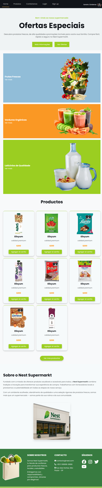
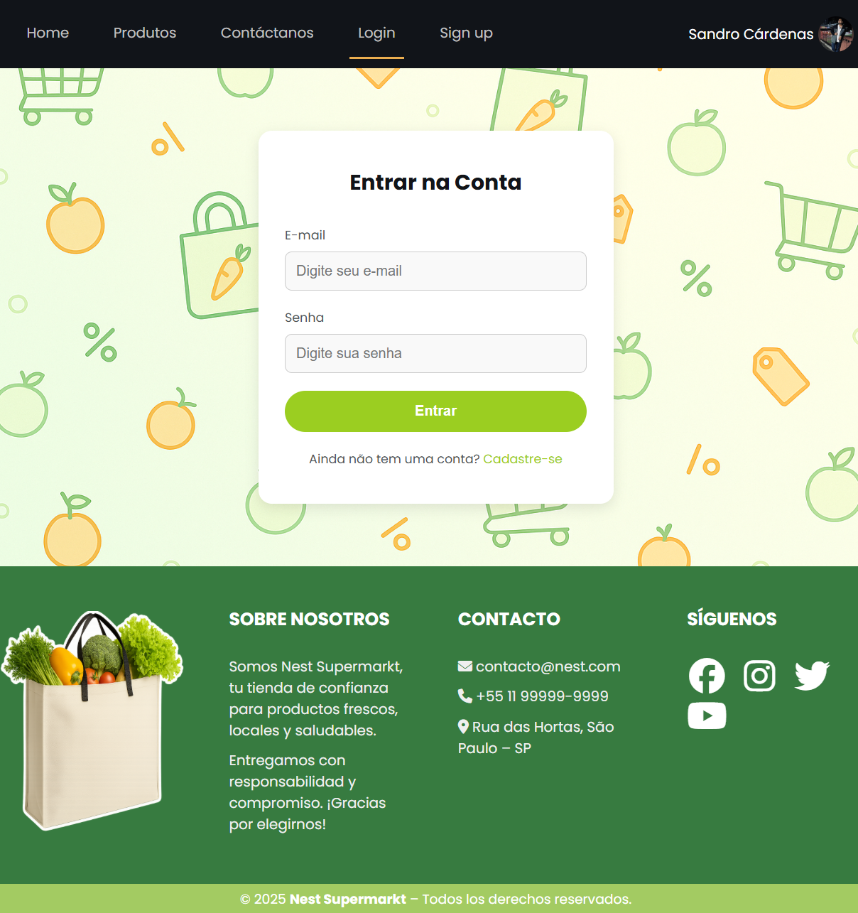
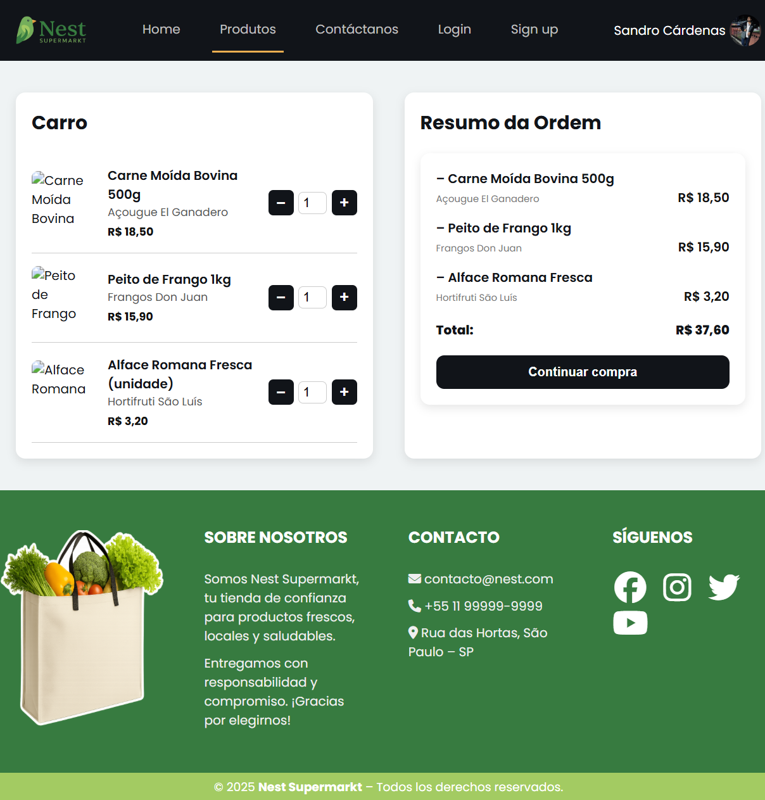
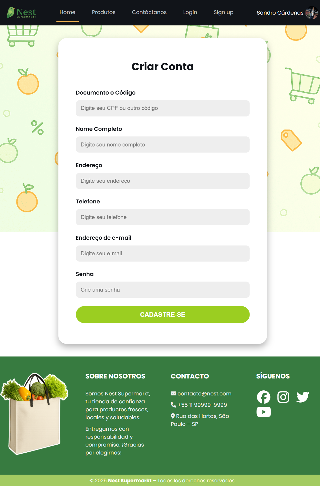
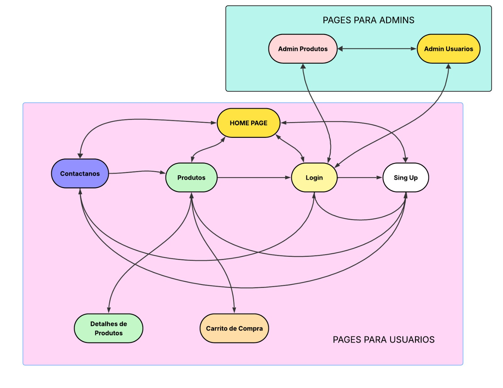

# 📄 Relatório de Projeto – Milestone 1: mockups da Loja Online

## 1. Identificação do Grupo

- **Ari Manuel Gamboa Aguilar** – USP nº 16796572  
- **Luis Enrique Asuncion Velasquez** – USP nº 16796593  
- **Sandro Fabrizio Cárdenas Vilca** – USP nº 16796589  

---

## 2. Requisitos

### 2.1. Requisitos Funcionais do Sistema

- O sistema deve ter dois tipos de usuários: **Clientes** e **Administradores**.
- **Administradores**:
  - Podem cadastrar, atualizar e remover produtos e usuários.
  - Devem ter os campos: nome, ID, telefone e email.
- **Clientes**:
  - Acessam a loja para comprar produtos.
  - Devem ter os campos: nome, ID, endereço, telefone e email.
- **Produtos/Serviços**:
  - Campos obrigatórios: nome, ID, foto, descrição, preço, quantidade em estoque, quantidade vendida.
  - Podem ser adicionados ao carrinho, com escolha de quantidade.
  - O estoque é atualizado após compra.
- **Carrinho de Compras**:
  - Armazena produtos até o pagamento.
  - O pagamento pode ser feito com qualquer número de cartão de crédito (simulado).
- O sistema deve:
  - Ser **acessível** e **usável**.
  - Ser **responsivo**, ou seja, reagir bem às ações do usuário.
    
### 2.2. Funcionalidade Específica do Projeto

A loja implementa uma funcionalidade especial chamada **“Produtos Mais Vendidos”**, visível no catálogo de produtos. Essa funcionalidade exibe uma seleção automática dos produtos com maior número de vendas, permitindo que os usuários vejam rapidamente os itens mais populares.

Atualmente, essa funcionalidade está representada de forma estática, mas nas próximas etapas será conectada ao backend, que calculará dinamicamente os produtos com maior quantidade vendida (`quantidade_vendida`).

Essa funcionalidade contribui para a experiência do usuário ao destacar itens com maior interesse do público, facilitando a tomada de decisão e promovendo a visibilidade de produtos populares.

---

## 3. Descrição do Projeto

### 3.1. Telas Implementadas em HTML/CSS

As seguintes páginas foram desenvolvidas com HTML5 e CSS3:

- `homepage.html` – Home page com apresentação e navegação.
- `loginpage.html` – Tela de login estática.
- `contactopage.html` – Formulário de contato com campos nome, e-mail e mensagem.

#### 🖼️ Capturas das Telas HTML Implementadas

- **Home Page**  
  

- **Página de Login**  
  

- **Página de Contato**  
  

### 3.2. Telas Criadas em Mockup (Figma)

As telas abaixo foram criadas no Figma e exportadas como imagens:

- Página de catálogo de produtos
- Página de detalhes do produto
- Página de carrinho de compras
- Página de registro de usuário

#### 🖼️ mockups (Figma)

- **Catálogo de Produtos**  
  

- **Detalhes do produto**
  

- **Carrinho de compras**
  

- **Registro de usuário**
  

---

## 4. Diagrama de Navegação

Abaixo está o diagrama representando as rotas entre as principais páginas do sistema:



---

## 5. Comentários sobre o Código

- Estrutura clara com `header`, `main`, `footer`.
- Navegação simulada por menus e links estáticos.
- CSS modularizado por página.
- As telas têm estilo visual coeso e moderno.

---

## 6. Plano de Testes

**Testes manuais realizados:**
- Carregamento correto dos arquivos HTML e CSS em navegadores modernos.
- Checagem da responsividade básica das páginas.
- Verificação de funcionamento dos links de navegação.

**Futuro:**
- Testes automatizados com ferramentas como Selenium.
- Integração de validações, autenticação e persistência de dados.

---

## 7. Resultados dos Testes

- As 3 páginas HTML renderizam corretamente no Chrome, Firefox e Edge.
- Estilos e estrutura visual mantêm consistência.
- Links de navegação operam de acordo com o fluxo proposto.

---

## 8. Procedimentos de Execução

### 8.1. Requisitos
- Navegador atualizado: Chrome, Firefox ou Edge.

### 8.2. Como Executar
1. Clonar o repositório:
   ```bash
   git clone https://github.com/GAMA544/milestone1-Supermarket.git
2. **Acessar a pasta do projeto.**

3. **Abrir localmente os seguintes arquivos HTML em seu navegador:**

   - `homepage.html`
   - `loginpage.html`
   - `contactopage.html`

---

## 9. Problemas Encontrados

- Tempo limitado para implementar navegação dinâmica no estilo SPA com JavaScript.
- Integração com backend (servidor e banco de dados) ainda não realizada.
- Melhorias futuras planejadas para responsividade completa e acessibilidade (uso em diferentes tamanhos de tela e dispositivos).

---

## 10. Comentários Finais

- O **Milestone 1** cumpre os objetivos principais: mockups das telas, proposta de navegação clara e desenvolvimento das páginas iniciais com HTML5/CSS3.
- O projeto está bem estruturado para ser expandido nas próximas etapas com JavaScript dinâmico, funcionalidades completas, banco de dados e autenticação.
- A equipe seguiu boas práticas de separação de arquivos, clareza de layout e organização do repositório.

---

## ✅ Arquivos Incluídos no Repositório

- `homepage.html`, `loginpage.html`, `contactopage.html`
- `styleshomepage.css`, `stylesloginpage.css`, `stylescontactopage.css`
- **mockups exportados do Figma:** armazenados na pasta `/img`
- **Diagrama de navegação:** `./img/navegation_diagram.png`
- `README.md` contendo este relatório completo

# 📄 Relatório de Projeto – Milestone 2: funcionalidades do cliente e Administrador

## 1. Identificação do Grupo

- **Ari Manuel Gamboa Aguilar** – USP nº 16796572  
- **Luis Enrique Asuncion Velasquez** – USP nº 16796593  
- **Sandro Fabrizio Cárdenas Vilca** – USP nº 16796589  

---

## 2. Requisitos Atualizados

### 2.1. Requisitos Funcionais (Atualizados)

O sistema cumpre os requisitos básicos do Milestone 1 e agora implementa as seguintes funcionalidades adicionais no Milestone 2:

- **Login inteligente com redirecionamento automático**:
  - Admins são redirecionados para o painel de administração.
  - Clientes são redirecionados à página de catálogo.

- **CRUD completo e funcional para administradores**:
  - **Adicionar, editar e excluir produtos**.
  - **Cadastrar novos administradores e editar usuários existentes**.

- **Formulários inteligentes**:
  - Máscaras automáticas para CPF, telefone e e-mail.
  - Validação de campos obrigatórios.

- **Carrinho de compras interativo e dinâmico**:
  - Adição e remoção de produtos em tempo real.
  - Atualização automática da quantidade, preço unitário e total da compra.

- **Resumo do pedido em tempo real**:
  - Quantidade de itens e valor total visível dinamicamente.

- **Geração de comprovante de compra em PDF**:
  - Ao finalizar a compra, o sistema gera uma **boleta de pagamento** com os dados do pedido.
  - O botão "Imprimir boleta" chama `window.print()`.

- **Envio de mensagens via “Contate-nos”**:
  - Os dados são enviados via `mailto:` para `supermarketnest9@gmail.com`.

- **Filtro por categoria**:
  - Os produtos podem ser filtrados por categoria no catálogo (`frutas`, `bebidas`, etc.).

- **Renderização automática do catálogo de produtos**:
  - Produtos armazenados no `localStorage` são carregados e renderizados dinamicamente.

- **Página de detalhes do produto individual**:
  - Cada produto possui uma página dedicada (`Produto_Individual.html`) com descrição detalhada, imagem ampliada e botão de compra.

- **Função de “Produtos mais vendidos”**:
  - Destaque de produtos com maior valor de `quantidade_vendida`, estático por ora.

- **Persistência local de dados**:
  - Todo o sistema simula um backend completo usando `localStorage`.

- **Sessão do usuário logado**:
  - Nome do usuário é exibido dinamicamente na interface.
  - A sessão é mantida entre páginas (controle por `localStorage`).

- **Separação visual de áreas do sistema**:
  - Navegação clara entre seções: cliente, administrador, carrinho, contato e produtos.

- **Estilo responsivo com CSS modularizado**:
  - Uso de media queries e CSS limpo.
  - Compatível com diferentes tamanhos de tela.

---

## 3. Descrição do Projeto (Implementação)

### 3.1. Telas Funcionais

- `homepage.html`: Página de entrada do sistema.
- `loginpage.html`: Login com distinção de perfis.
- `register.html`: Registro de novos usuários.
- `Produtos_Page.html`: Catálogo com filtro por categoria.
- `Produto_Individual.html`: Detalhes e compra de um produto.
- `carrito_compras.html`: Carrinho interativo.
- `pagamento.html`: Página de pagamento e emissão de boleta.
- `usuario.html`: Dados do cliente logado.
- `contactopage.html`: Formulário de contato.

### 3.2. Área Administrativa

- `admin-productos.html`: Lista e controle dos produtos cadastrados.
- `admin-usuarios.html`: Visualização de todos os usuários e admins.
- `admin-add-product.html`, `admin-edit-product.html`: CRUD de produtos.
- `admin-add-admin.html`, `admin-edit-user.html`: Gerenciamento de admins.

---

## 4. Comentários sobre o Código

- Scripts JavaScript organizados por responsabilidade funcional.
- Separação entre lógica de renderização e manipulação de dados.
- Uso consistente de `localStorage` como repositório de dados.
- Scripts como `renderAdminUsers.js`, `renderizarCarrinho.js`, `contatanos.js` e `user_info.js` fornecem modularidade e reusabilidade.

---

## 5. Plano de Testes

**Testes manuais realizados:**

- Login e redirecionamento de usuários.
- Renderização de produtos e filtro por categoria.
- Manipulação completa do carrinho.
- Geração de boleta em PDF com produtos corretos.
- CRUD de produtos e usuários.
- Teste de envio de mensagens pelo formulário de contato.
- Máscaras aplicadas corretamente nos campos dos formulários.

---

## 6. Resultados dos Testes

Todos os testes foram executados com sucesso. As funcionalidades estão operacionais com resultados consistentes. Nenhum bug crítico foi identificado.

| Funcionalidade                         | Status |
|----------------------------------------|--------|
| Login de cliente/admin                 | ✅     |
| Redirecionamento por tipo de usuário   | ✅     |
| Carrinho com total dinâmico            | ✅     |
| CRUD de produtos e usuários            | ✅     |
| Geração de boleta                      | ✅     |
| Formulário “Contate-nos”               | ✅     |
| Máscara de CPF/telefone                | ✅     |
| Sessão e nome do usuário logado        | ✅     |
| Filtro por categoria                   | ✅     |
| SPA parcial com navegação              | ✅     |

---

## 7. Procedimentos de Execução

### 7.1. Requisitos

- Navegador moderno (recomenda-se Google Chrome).

### 7.2. Execução

1. Clonar o repositório:
   ```bash
   git clone https://github.com/GAMA544/milestone1-Supermarket.git


