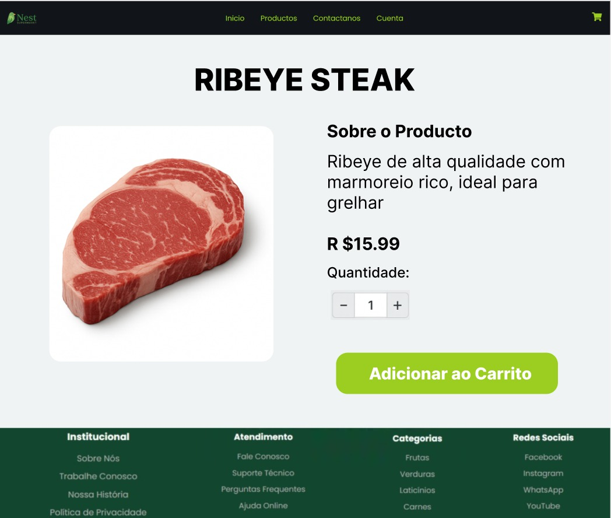
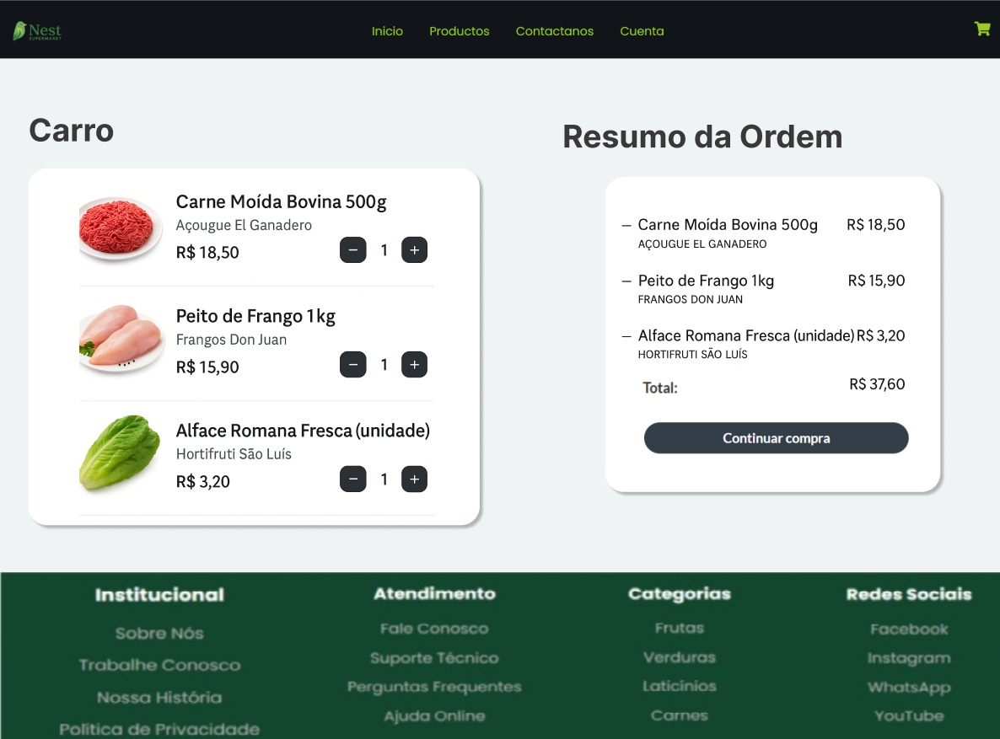
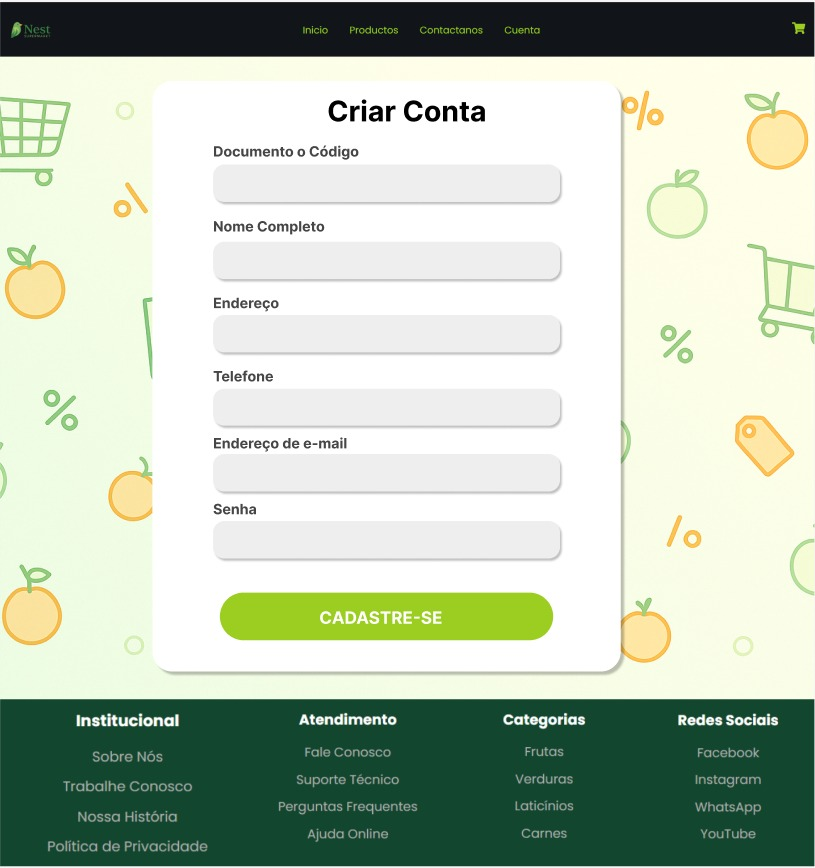

# 📄 Relatório de Projeto – Milestone 1: Mockups da Loja Online

## 1. Identificação do Grupo

- **Ari Manuel Gamboa Aguilar** – USP nº 16796572  
- **Luis Enrique Asuncion Velasquez** – USP nº 16796593  
- **Sandro Fabrizio Cárdenas Vilca** – USP nº 16796589  

---

## 2. Requisitos

### 2.1. Requisitos Funcionais do Sistema (conforme especificação da atividade)

- O sistema deve ter dois tipos de usuários: **Clientes** e **Administradores**.
- **Administradores**:
  - Podem cadastrar, atualizar e remover produtos e usuários.
  - Devem ter os campos: nome, ID, telefone e email.
- **Clientes**:
  - Acessam a loja para comprar produtos.
  - Devem ter os campos: nome, ID, endereço, telefone e email.
- **Produtos/Serviços**:
  - Campos obrigatórios: nome, ID, foto, descrição, preço, quantidade em estoque, quantidade vendida.
  - Podem ser adicionados ao carrinho, com escolha de quantidade.
  - O estoque é atualizado após compra.
- **Carrinho de Compras**:
  - Armazena produtos até o pagamento.
  - O pagamento pode ser feito com qualquer número de cartão de crédito (simulado).
- O sistema deve:
  - Ser **acessível** e **usável**.
  - Ser **responsivo**, ou seja, reagir bem às ações do usuário.
- Funcionalidade adicional específica: será definida nas próximas fases.

---

## 3. Descrição do Projeto

### 3.1. Telas Implementadas em HTML/CSS

As seguintes páginas foram desenvolvidas com HTML5 e CSS3:

- `homepage.html` – Home page com apresentação e navegação.
- `loginpage.html` – Tela de login estática.
- `contactopage.html` – Formulário de contato com campos nome, e-mail e mensagem.

#### 🖼️ Capturas das Telas HTML Implementadas

- **Home Page**  
  

- **Página de Login**  
  

- **Página de Contato**  
  

### 3.2. Telas Criadas em Mockup (Figma)

As telas abaixo foram criadas no Figma e exportadas como imagens:

- Página de catálogo de produtos
- Página de detalhes do produto
- Página de carrinho de compras
- Página de registro de usuário

#### 🖼️ Mockups (Figma)

- **Catálogo de Produtos**  
  

- **Detalhes do produto**
  

- **Carrinho de compras**
  

- **Registro de usuário**
  

---

## 4. Diagrama de Navegação

Abaixo está o diagrama representando as rotas entre as principais páginas do sistema:

