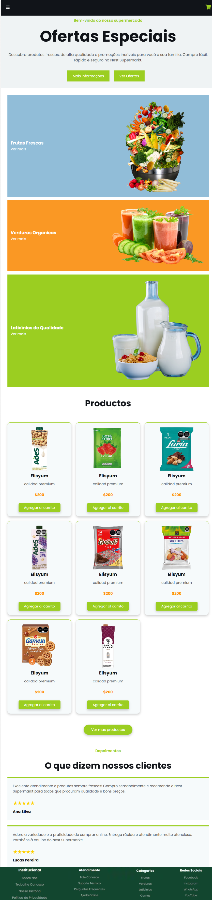
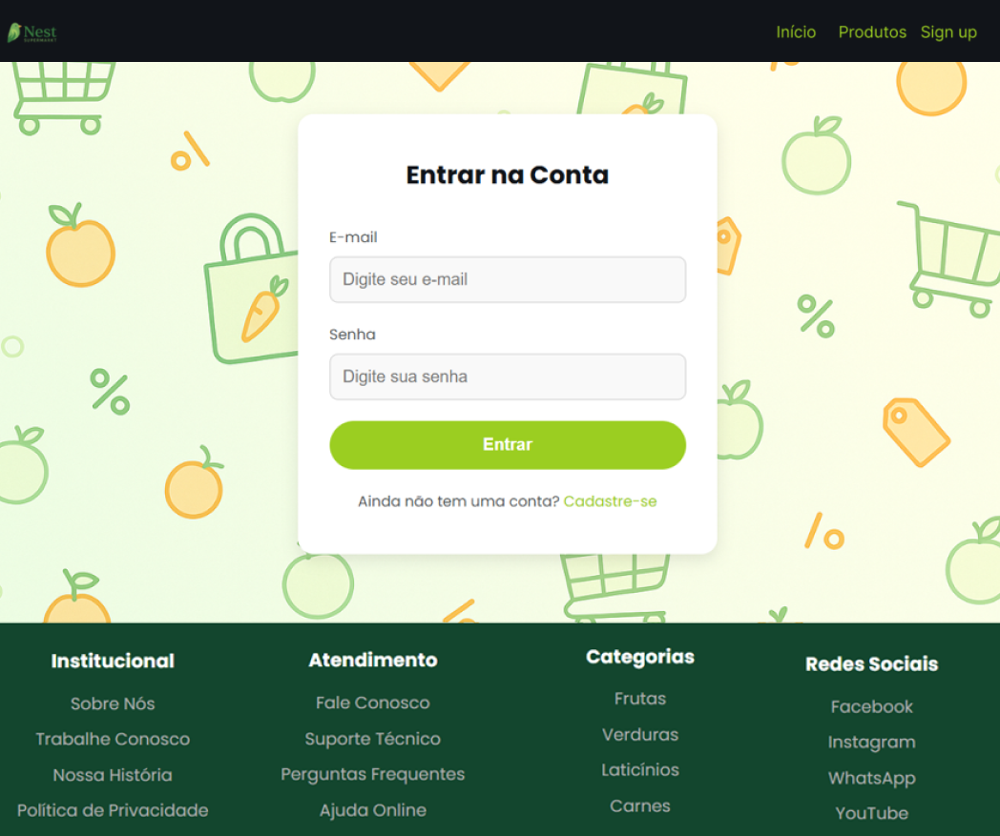
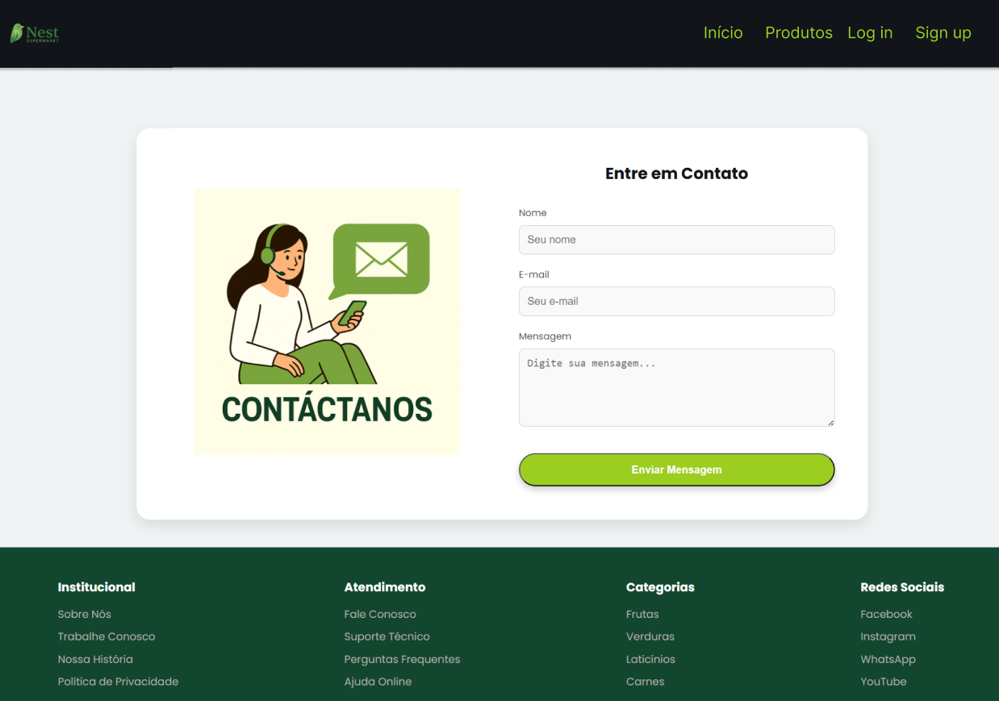
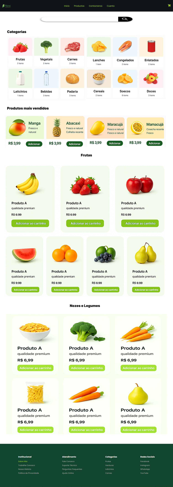
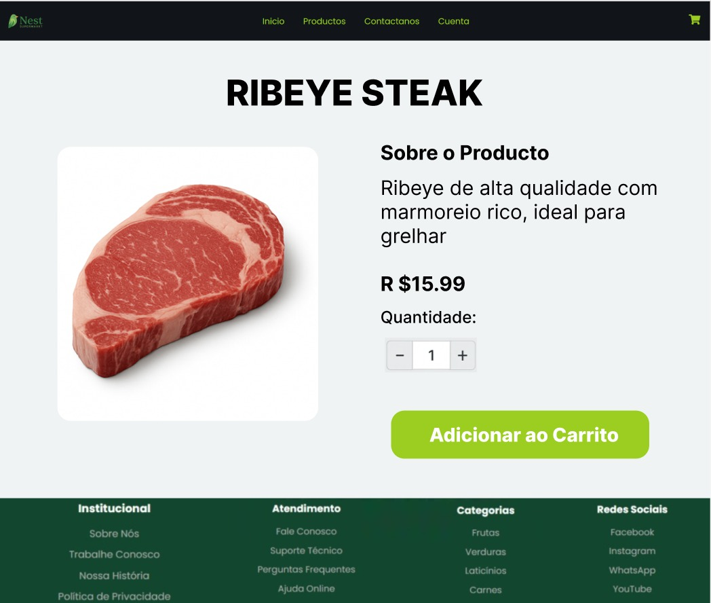
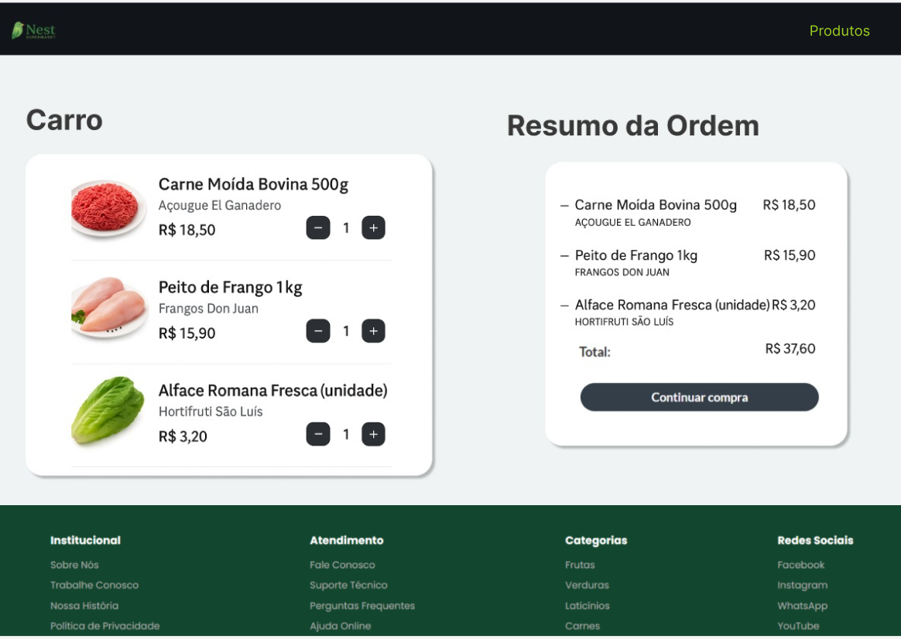
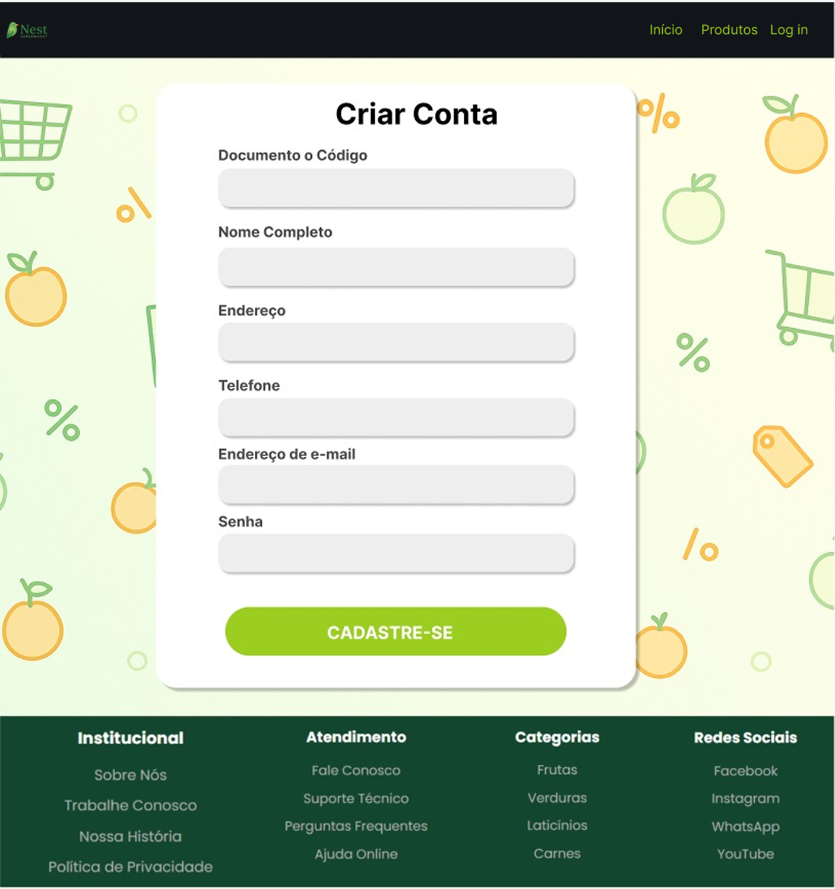
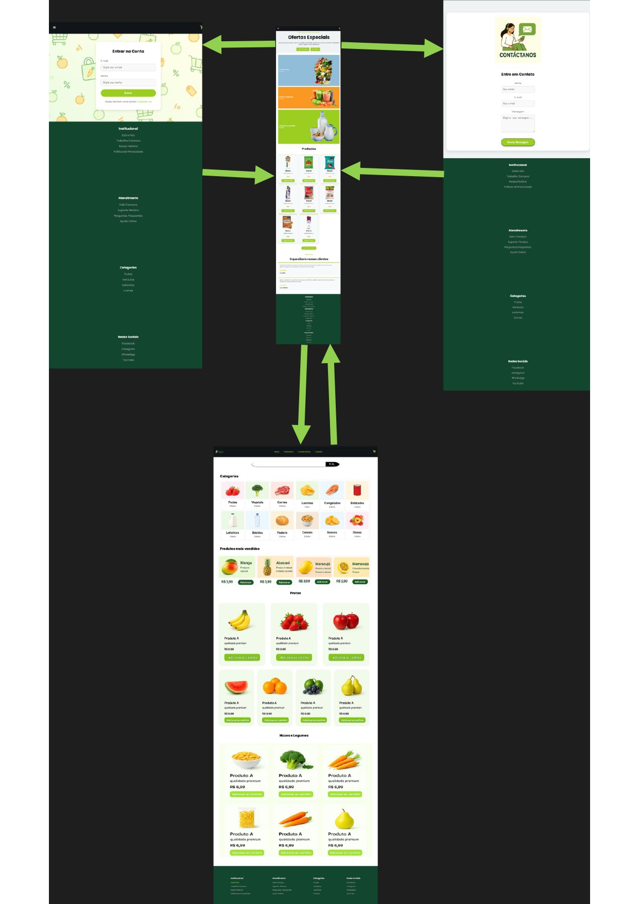

# 📄 Relatório de Projeto – Milestone 1: Mockups da Loja Online

## 1. Identificação do Grupo

- **Ari Manuel Gamboa Aguilar** – USP nº 16796572  
- **Luis Enrique Asuncion Velasquez** – USP nº 16796593  
- **Sandro Fabrizio Cárdenas Vilca** – USP nº 16796589  

---

## 2. Requisitos

### 2.1. Requisitos Funcionais do Sistema (conforme especificação da atividade)

- O sistema deve ter dois tipos de usuários: **Clientes** e **Administradores**.
- **Administradores**:
  - Podem cadastrar, atualizar e remover produtos e usuários.
  - Devem ter os campos: nome, ID, telefone e email.
- **Clientes**:
  - Acessam a loja para comprar produtos.
  - Devem ter os campos: nome, ID, endereço, telefone e email.
- **Produtos/Serviços**:
  - Campos obrigatórios: nome, ID, foto, descrição, preço, quantidade em estoque, quantidade vendida.
  - Podem ser adicionados ao carrinho, com escolha de quantidade.
  - O estoque é atualizado após compra.
- **Carrinho de Compras**:
  - Armazena produtos até o pagamento.
  - O pagamento pode ser feito com qualquer número de cartão de crédito (simulado).
- O sistema deve:
  - Ser **acessível** e **usável**.
  - Ser **responsivo**, ou seja, reagir bem às ações do usuário.
- Funcionalidade adicional específica: será definida nas próximas fases.

---

## 3. Descrição do Projeto

### 3.1. Telas Implementadas em HTML/CSS

As seguintes páginas foram desenvolvidas com HTML5 e CSS3:

- `homepage.html` – Home page com apresentação e navegação.
- `loginpage.html` – Tela de login estática.
- `contactopage.html` – Formulário de contato com campos nome, e-mail e mensagem.

#### 🖼️ Capturas das Telas HTML Implementadas

- **Home Page**  
  

- **Página de Login**  
  

- **Página de Contato**  
  

### 3.2. Telas Criadas em Mockup (Figma)

As telas abaixo foram criadas no Figma e exportadas como imagens:

- Página de catálogo de produtos
- Página de detalhes do produto
- Página de carrinho de compras
- Página de registro de usuário

#### 🖼️ Mockups (Figma)

- **Catálogo de Produtos**  
  

- **Detalhes do produto**
  

- **Carrinho de compras**
  

- **Registro de usuário**
  

---

## 4. Diagrama de Navegação

Abaixo está o diagrama representando as rotas entre as principais páginas do sistema:



---

## 5. Comentários sobre o Código

- Estrutura clara com `header`, `main`, `footer`.
- Navegação simulada por menus e links estáticos.
- CSS modularizado por página.
- As telas têm estilo visual coeso e moderno.

---

## 6. Plano de Testes

**Testes manuais realizados:**
- Carregamento correto dos arquivos HTML e CSS em navegadores modernos.
- Checagem da responsividade básica das páginas.
- Verificação de funcionamento dos links de navegação.

**Futuro:**
- Testes automatizados com ferramentas como Selenium.
- Integração de validações, autenticação e persistência de dados.

---

## 7. Resultados dos Testes

- As 3 páginas HTML renderizam corretamente no Chrome, Firefox e Edge.
- Estilos e estrutura visual mantêm consistência.
- Links de navegação operam de acordo com o fluxo proposto.

---

## 8. Procedimentos de Execução

### 8.1. Requisitos
- Navegador atualizado: Chrome, Firefox ou Edge.

### 8.2. Como Executar
1. Clonar o repositório:
   ```bash
   git clone https://github.com/GAMA544/milestone1-Supermarket.git
2. **Acessar a pasta do projeto.**

3. **Abrir localmente os seguintes arquivos HTML em seu navegador:**

   - `homepage.html`
   - `loginpage.html`
   - `contactopage.html`

---

## 9. Problemas Encontrados

- Tempo limitado para implementar navegação dinâmica no estilo SPA com JavaScript.
- Integração com backend (servidor e banco de dados) ainda não realizada.
- Melhorias futuras planejadas para responsividade completa e acessibilidade (uso em diferentes tamanhos de tela e dispositivos).

---

## 10. Comentários Finais

- O **Milestone 1** cumpre os objetivos principais: mockups das telas, proposta de navegação clara e desenvolvimento das páginas iniciais com HTML5/CSS3.
- O projeto está bem estruturado para ser expandido nas próximas etapas com JavaScript dinâmico, funcionalidades completas, banco de dados e autenticação.
- A equipe seguiu boas práticas de separação de arquivos, clareza de layout e organização do repositório.

---

## ✅ Arquivos Incluídos no Repositório

- `homepage.html`, `loginpage.html`, `contactopage.html`
- `styleshomepage.css`, `stylesloginpage.css`, `stylescontactopage.css`
- **Mockups exportados do Figma:** armazenados na pasta `/img`
- **Diagrama de navegação:** `./img/navegation_diagram.png`
- `README.md` contendo este relatório completo

